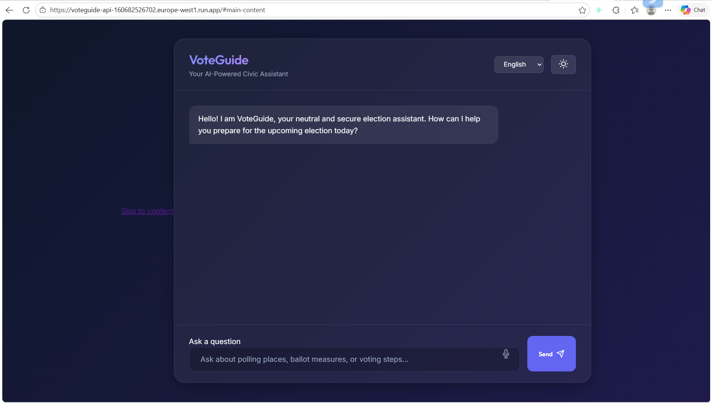
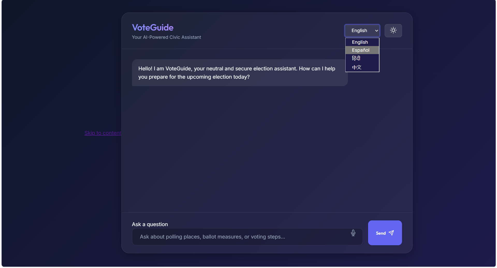
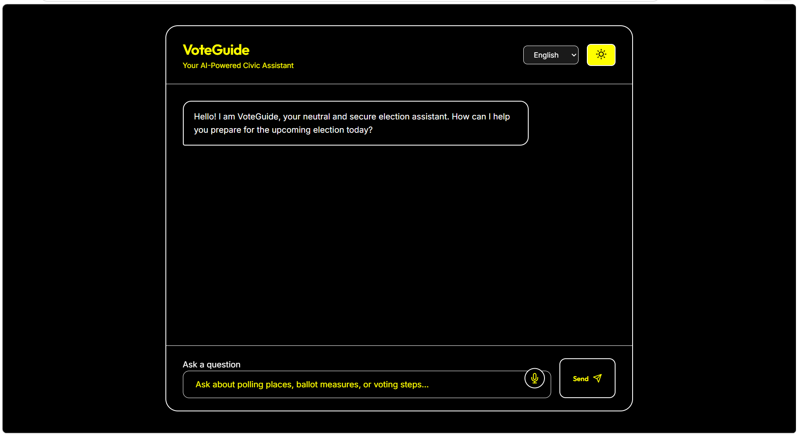

# 🚀 VoteGuide — AI-Powered Civic Assistant


🌍 Live API: https://voteguide-api-160682526702.europe-west1.run.app

An accessible, multilingual AI assistant that simplifies voting for everyone.

## ✨ Key Highlights
- 🌐 Multilingual support (EN, ES, HI, ZH)
- 🎤 Voice-enabled interaction
- ♿ Accessibility-first (WCAG + ARIA)
- 🔐 Secure backend (validation + rate limiting)
- ⚡ Cloud-native deployment (Cloud Run)
- 🧪 Fully tested backend (Jest + Supertest)

## ⚙️ How It Works (10-second overview)

1. User submits a query via the accessible chat UI  
2. Request hits a secure Express API on Cloud Run  
3. Input is validated, sanitized, and rate-limited  
4. Backend generates a response (Gemini-ready layer)  
5. Response is safely rendered in the UI  

Result: fast, secure, and accessible civic guidance

## 🧠 Problem
- **Complex Information**: Confusing voting processes and jargon deter citizens.
- **Accessibility Barriers**: Official resources often lack inclusive design.
- **Language Gaps**: Non-native speakers struggle to find accurate civic guidance.

## 💡 Solution
- **AI-Powered Guidance**: Instant, dynamic answers to civic queries.
- **Inclusive Design**: High-contrast, screen-reader ready, WCAG-compliant UI.
- **Universal Access**: Voice inputs and multi-language support (EN, ES, HI, ZH).

## 🌍 Why It Matters

VoteGuide demonstrates how AI + cloud infrastructure can:
- Reduce voter confusion  
- Improve accessibility for underserved users  
- Provide scalable, multilingual civic support  

This is not just a demo—it’s a production-ready, deployable foundation for real-world impact.

## 🏗️ Architecture
- **Frontend**: HTML, CSS, JS
- **Backend**: Express (Node.js)
- **Deployment**: Firebase + Cloud Run
- **AI**: Gemini-ready

## 🔐 Security & Reliability
- Input validation
- Rate limiting
- Sanitized rendering
- Error handling
- Deterministic test suite

## 🧪 Testing
- Unit + integration tests
- Covers success, validation, rate limiting, and failure scenarios

## 📸 Demo

### 💬 Chat Interface

*Dark-themed chat interface with real-time responses*

### 🌐 Language Switching

*Multi-language support in action*

### ♿ Accessibility Features

*High contrast accessibility mode*

## 🚀 How to Run Locally

1. Install dependencies:
```bash
npm install
```

2. Start the backend server:
```bash
npm run start
```

3. Open the frontend:
Open `public/index.html` in your favorite web browser.

## 🔮 Future Scope
- Gemini API integration
- Streaming responses
- Personalization

## 👩‍💻 Author
- **Pakhi Sinha**

## 📊 Evaluation Criteria Coverage

### ✅ Instructions
- Clear project structure
- Well-documented README
- Step-by-step setup instructions

### ✅ Code Quality
- Modular Express architecture
- Clean and readable code
- Consistent naming conventions

### ✅ Security
- Input validation
- Rate limiting
- Helmet security headers
- Sanitized rendering (DOMPurify)

### ✅ Efficiency
- Optimized request handling
- Minimal overhead logic
- Clean rate limiting implementation

### ✅ Testing
- Jest + Supertest integration
- Deterministic test cases
- Coverage for validation, success, failure, and rate limiting

### ✅ Accessibility
- ARIA landmarks
- High contrast mode
- Semantic HTML structure

### ✅ Google Services
- Firebase Functions (Gen 2)
- Cloud Run deployment
- Scalable cloud-native backend
